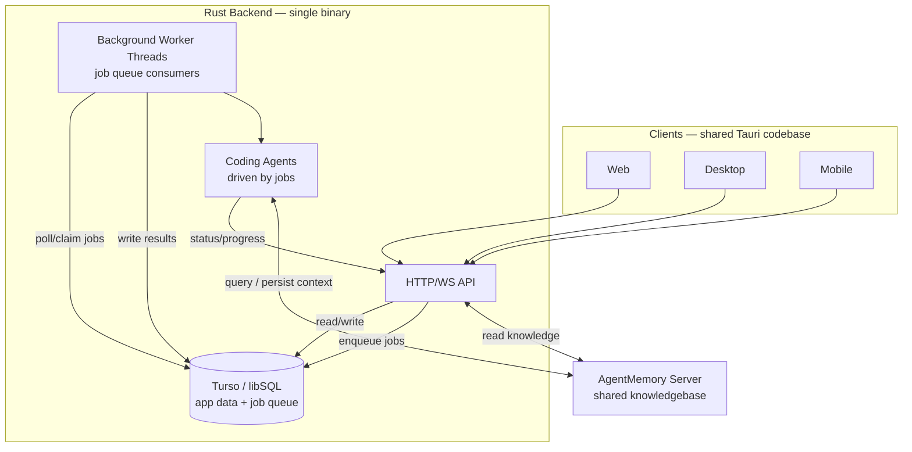

# Dearborn: Easy Setup Software Factory

## Goal

The idea behind Dearborn is to make it easy to get up and running with a software factory. A user could install a single binary on a VPS, personal server, etc., connect an llm subscription or api key, connect a git repository (Github, Gitea, etc.) and then open the desktop or mobile app to begin building software with Dearborn

## Core System Components

These will be some of the key components of Dearborn

1. A central knowledge base powered by [agentmemory](https://github.com/rohitg00/agentmemory). This allows Dearborn to compound in value the more you use it by learning the "Why" behind every part of the project.
2. A lightweight task management system (similar to Github Issues or Linear). There will be epics to represent large features and then regular tasks. Tasks can either be part of an epic or stand on their own. Tasks that are part of an epic have a dependency graph to clearly show what work needs to come first. Tasks will also track not only the work but also the agent session that implemented them. 
3. An agent orchestrator to take tasks that are ready to be implemented and trigger coding agents like claude code, pi, codex, etc. to implement them. 

## Workflow

The main workflow for Dearborn will look something like this

1. User chats with the product planning agent to plan out the scope of an epic from a product perspective. agent uses its knowledge of the codebase both from direct inspection as well as the agentmemory kb to guide the planning. Not from a technical perspective but from a business/product perspective. The output of this planning session is an Epic (status is `Planning`)
2. User chats with the technical planning agent that refines the epic and adds necessary technical context.
3. When the user is happy with the plan they can move the Epic to `In Progress`. This will kick off the following automated workflow
  4. The epic is broken down into small, focused tasks that can be handed to individual coding agents to implement. The tasks are attached to the epic with a dependency graph representing the order they need to be completed in
  5. The agent orchestrator will work through all of the tasks in dependency order until the epic has been implemented. It will then open a PR with all of the changes 

## High-level Client Overview

In addition to the Dearborn server there will also be clients apps for web, desktop and mobile (using Tauri with Vue/Typescript for shared codebase)

### Projects Page

A project in Dearborn is the highest-level entity. Represents a single software project/product. For the MVP version a project will
- Be connected to a single git repository (1-1 mapping)
- Have a single shared knowledge base (knowledge bases are not shared across projects)
- To create a new project all you need is a git repository and a name

### Project Detail Page

The project detail page will be a kanban board representing just the epics and tasks that do not have a parent epic (tasks inside of an epic will be visible in the epic detail page). Kanban lanes will be in `Planning`, `Ready`, `In Progress`, `Completed`, and `Cancelled`

Although it will be possible to hand-create an epic, the main way will be through a planning session with an agent

### Epics Detail Page

You can drill down into each epic to see

- Detailed description and other metadata
- kanban board representing all of the tasks within the epic

## Architecture

1. A backend server deployed as a single rust binary that will encompase
  - an api for clients to interact with
  - a sqlite database for storage (using Turso instead of normal Sqlite)
  - background threads processing job queues via sqlite. There background jobs drive coding agents to implement tasks

2. an agentmemory server for shared knowledgebase

3. Web/Desktop/Mobile clients (powered through a single shared Tauri codebase)

## Future

This is an ambitious project so it will be important to keep the MVP scoped as tightly as possible. There are endless improvements that could be made to this system, especially making it more flexible. Some ideas for future consideration

- Tie into existing issue trackers like Linear and Github Issues
- Allow multiple repositories to be tied to a project
- Support all of the major coding agents and allow you to authenticate and use your claude code/codex subscription. For v1 we will just use an OpenRouter api key
